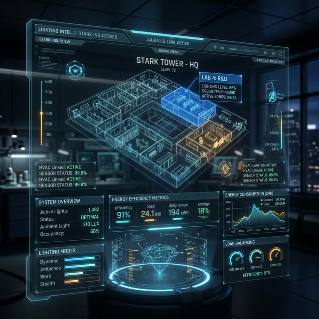

# 💡 LiteLab | Lighting Intelligence System



> "Is it too much to ask for both? I want a world where we don't just see—we experience. And I want it to be efficient. Really, really efficient." — *Not me, but sounds like something I'd say.*

Welcome to **LiteLab**. This isn't just another lighting dashboard. It's the future of spatial illumination, engineered for those who demand precision, performance, and—let's be honest—a bit of style. 

Whether you're lighting a Stark Industries-level gallery or just making sure your home office doesn't look like a dungeon, LiteLab has the telemetry you need.

---

## 🚀 Advanced Tech Stack

### 🧠 Intelligence Dashboard
Real-time energy analytics that make J.A.R.V.I.S. look like a calculator. Track wattage, lumens, and efficiency (lm/W) with surgical precision. If it's not green on the ROI chart, why are we even talking?

### 🌐 3D Spatial Preview
Stop guessing. Our Three.js-powered workspace lets you simulate lighting layouts in a full 3D environment. Drag, drop, and witness the photons dance before you even pick up a screwdriver.

### 📉 ROI Telemetry & Benchmarking
Money matters. LiteLab calculates your payback periods and annual savings faster than I can fly to Malibu. Compare your fixtures against industry standards and see where you're bleeding cash.

### 🎯 Smart Recommendations
Need the perfect fixture for a high-ceiling museum? Our recommendation engine filters through the noise to find the hardware that matches your requirements. Precision is key.

---

## 🛠 Project Blueprint

- **Frontend Core**: Vanilla JS (because dependencies are just extra weight)
- **Engine**: Three.js for 3D Spatial Rendering
- **Analytics**: Chart.js for data visualization
- **Document Generation**: jsPDF for high-fidelity project reports

---

## 🏗 Installation (For the interns)

1. **Clone the repo:**
   ```bash
   git clone https://github.com/A-Generative-Slice/litelab.git
   ```
2. **Open `index.html`** in your favorite browser. (Chrome or Brave, obviously. Let's keep it modern.)
3. **Initialize the system.** Lighting Intelligence is now online.

---

## 👔 The Mission

LiteLab is built on the belief that lighting should be smart, sustainable, and stunning. We don't just provide data; we provide clarity. 

*Stay bright.*

---
© 2026 A Generative Slice. All rights reserved. 🧥
